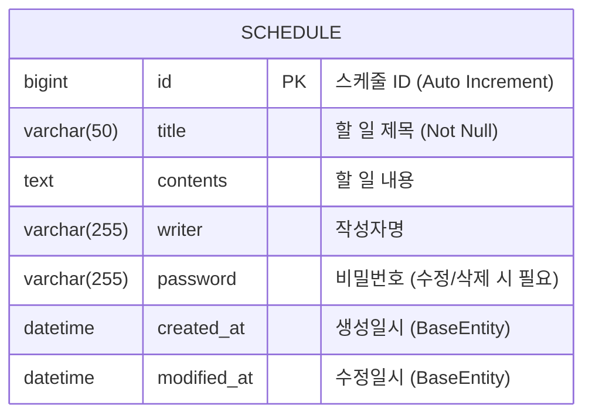

# 📋 스케줄 관리 앱 (Schedule Management API)

Spring Boot와 JPA를 사용하여 구현한 일정 관리 백엔드 API 서비스입니다.
할 일을 생성, 조회, 수정, 삭제(CRUD)할 수 있으며, 비밀번호 인증을 통해 데이터 무결성을 보호합니다.

## 🛠 Tech Stack

- **Java**: 17+
- **Spring Boot**: 3.x
- **JPA (Hibernate)**: ORM
- **Database**: H2 / MySQL (설정에 따름)

## 📊 ERD (Entity Relationship Diagram)



## 📝 API 명세서 (API Specification)

**Base URL:** `/jpas`

| 기능 | Method | URL | 설명 | 필수 값 |
| :--- | :---: | :--- | :--- | :--- |
| **일정 생성** | `POST` | `/jpas` | 새로운 일정을 생성합니다. | `title`, `contents`, `writer`, `password` |
| **단건 조회** | `GET` | `/jpas/{scheduleId}` | 특정 ID의 일정을 조회합니다. | `scheduleId` (Path) |
| **전체 조회** | `GET` | `/jpas` | 등록된 모든 일정을 조회합니다. | - |
| **일정 수정** | `PUT` | `/jpas/{scheduleId}` | 작성자, 제목을 수정합니다. (비밀번호 검증) | `title`, `writer`, `password` |
| **일정 삭제** | `DELETE` | `/jpas/{scheduleId}` | 일정을 삭제합니다. (비밀번호 검증) | `password` |

---

### 1. 일정 생성 (Create Schedule)

- **URL:** `POST /jpas`
- **Description:** 새로운 일정을 등록합니다.
- **Request Body (JSON)**

```json
{
  "title": "백엔드 스터디",
  "contents": "JPA 영속성 컨텍스트 공부하기",
  "writer": "김개발",
  "password": "1234"
}
```

- **Response (201 Created)**

```json
{
  "id": 1,
  "title": "백엔드 스터디",
  "contents": "JPA 영속성 컨텍스트 공부하기",
  "writer": "김개발",
  "createdAt": "2024-02-05T10:00:00",
  "modifiedAt": "2024-02-05T10:00:00"
}
```

---

### 2. 일정 단건 조회 (Get One Schedule)

- **URL:** `GET /jpas/{scheduleId}`
- **Description:** 선택한 일정의 상세 정보를 조회합니다.
- **Path Variable:** `scheduleId` (일정 고유 ID)
- **Response (200 OK)**

```json
{
  "id": 1,
  "title": "백엔드 스터디",
  "contents": "JPA 영속성 컨텍스트 공부하기",
  "writer": "김개발",
  "createdAt": "2024-02-05T10:00:00",
  "modifiedAt": "2024-02-05T10:00:00"
}
```

---

### 3. 일정 전체 조회 (Get All Schedules)

- **URL:** `GET /jpas`
- **Description:** 등록된 모든 일정을 조회합니다.
- **Response (200 OK)**

```json
[
  {
    "id": 1,
    "title": "백엔드 스터디",
    "contents": "JPA 공부",
    "writer": "김개발",
    "createdAt": "2024-02-05T10:00:00",
    "modifiedAt": "2024-02-05T10:00:00"
  },
  {
    "id": 2,
    "title": "운동하기",
    "contents": "헬스장 가기",
    "writer": "이건강",
    "createdAt": "2024-02-05T11:00:00",
    "modifiedAt": "2024-02-05T11:00:00"
  }
]
```

---

### 4. 일정 수정 (Update Schedule)

- **URL:** `PUT /jpas/{scheduleId}`
- **Description:** 비밀번호가 일치할 경우, **제목(title)**과 **작성자(writer)**를 수정할 수 있습니다.
-